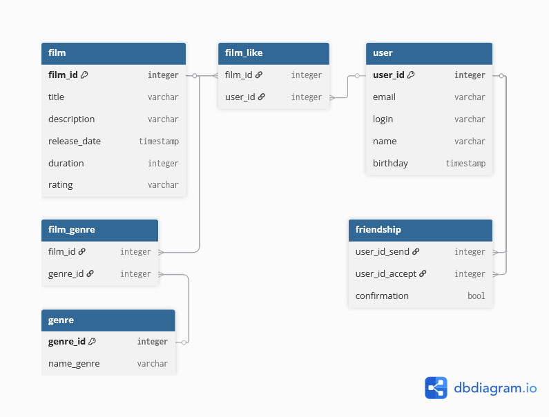

# java-filmorate

## Описание диаграммы БД
### 1. Используется 2 основные таблицы: "film" и "user"
#### 1.1 Таблица "film" соответствует классу "Film" и все поля из класса "Film" в ней присутствуют, за исключением "like" и "genre"
#### 1.2 Таблица "user" соответствует классу "User" и все поля из класса "User" в ней присутствуют, за исключением "friends"
###
### 2. Остальные таблицы являются связующими и предназначены для нормализации баз данных
#### 2.1 Таблица "film_like" является связующей для таблиц "film" и "user"
##### Из данной таблицы берутся данные для поля "like" класса "Film"
#### 2.2 Таблица "film_genre" является связующей для таблиц "film" и "genre"
##### Из данной таблицы берутся данные для поля "genre" класса "Film"
#### 2.3 Таблица "genre" необходима для нормализации баз данных
##### В случае изменения наименования жанра необходимо его изменить лишь один раз в данной таблице)
#### 2.4 Таблица "friendship" является таблицей отношений пользователей
##### В ней присутствует 2 ключа, которые являются id пользователей.
##### Если один пользователь отправил заявку второму, то формируется новая строка и флаг "confirmation" становится по-умолчанию = false
##### Когда второй пользователь подтвердит заявку в друзья, то флаг меняется на = true
##### Выгрузка всех друзей пользователя осуществляется с помощью объединения (UNION) данных из таблицы "friendship"
##### Примерно так:
##### SELECT user_id_accept
##### FROM friendship
##### WHERE user_id_send = "запрашиваемый Id" AND confirmation = true
##### UNION
##### SELECT user_id_send
##### FROM friendship
##### WHERE user_id_accept = "запрашиваемый Id" AND confirmation = true
